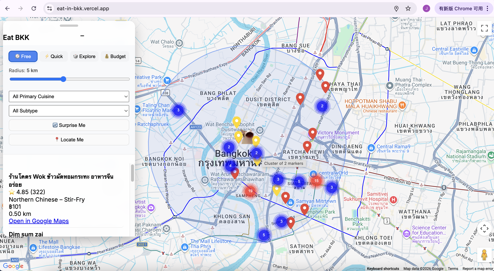

# 🍜 EatBKK – Bangkok Smart Chinese Food Map

An interactive web map for discovering Chinese restaurants in Bangkok.

EatBKK combines data collection, data cleaning, geospatial processing, and a lightweight web interface to help users explore Chinese food locations across the city.

This project demonstrates a complete workflow from raw Google Maps data to a deployable interactive map application.


# 🌏 Live Demo

The live application is available via Vercel.
[https://eat-in-bkk.vercel.app/]


# 🗺️ Project Preview



The interactive map allows users to:

- explore Chinese restaurants in Bangkok  
- view restaurant locations on the map  
- inspect ratings and restaurant information  
- access Google Maps navigation links  


# ✨ Features

- Interactive map built with **Google Maps API**
- Structured restaurant dataset generated from **Google Maps exports**
- Automated **data cleaning pipeline using Python**
- Geographic coordinate extraction from **Google Maps URLs**
- Lightweight frontend using **HTML + JavaScript**
- Ready for **serverless deployment with Vercel**


# 🔄 Project Workflow

The project follows a simple data-to-application pipeline:

Google Maps Export (CSV)

⬇️

Python Data Cleaning

⬇️

Coordinate Extraction

⬇️

Structured Dataset (JSON)

⬇️

Interactive Web Map

⬇️

Deployment (Vercel)


# 🧠 Data Processing Pipeline

## 1 Data Collection

Restaurant data is exported from Google Maps as CSV files.

Typical fields include:

- restaurant name
- rating
- review count
- category
- address
- Google Maps URL
- image link

However, the raw dataset requires cleaning because:

- the first rows may contain invalid entries
- column names are encoded
- geographic coordinates are embedded in URLs


## 2 Data Cleaning

A Python script processes the raw dataset.

Cleaning steps include:

- removing invalid header rows
- renaming encoded columns
- selecting relevant attributes
- removing duplicate restaurants
- cleaning review count values
- extracting geographic coordinates

Deduplication is performed using the **Google Maps URL**, which uniquely identifies each location.


## 3 Coordinate Extraction

Google Maps URLs often contain coordinates in formats such as:

!3d13.735…!4d100.523…

or

@13.735,100.523


Regular expressions are used to extract:

- latitude
- longitude

These coordinates enable geospatial visualization.

**Note:** At this stage, there are still some missing need to be revised, and it will be processed by hand.


## 4 Dataset Generation

After processing, the dataset is exported as:

restaurants.json

Example record:

{

"name":"Restaurant Example", 

"lat":13.81298,

"lon":100.5634807,

"primary_cuisine":"Sichuan & Chongqing",

"cuisine_subtype":"Ma La Tang",

"weighted_rating":4.7671345232,

"rating_norm":0.8696005994,

"review_count":385,

"review_weight_norm":0.6535768072,

"price_mid":100.5,

"address":"243 23 Lat Phrao 1",

"url":"https://maps.google.com/
...",

"image_url": "https://..."

}

This structured dataset is then consumed by the web application.


# 🏗️ System Architecture

The system contains three main components:


# 📁 Project Structure
EatBKK/

scripts/
clean_google_maps_dataset.py
generate_restaurants_json.py

restaurants.json
index.html
cat_images.png

README.md


Explanation:

**scripts/**  
Python scripts used for dataset cleaning and processing.

**restaurants.json**  
Structured dataset used by the web map.

**index.html**  
Frontend interface for the interactive map.

**cat_images.png**  
User's location image for the project.


# 🚀 Usage

## Current data workflow

The canonical source is `data/bangkok_food_combined_ready.xlsx`. The builder also
accepts a CSV source through `--input`.

```bash
python3 -m pip install -r requirements.txt
python3 scripts/build_data.py
python3 scripts/build_data.py --check
python3 -m unittest discover -s tests -p "test_*.py"
```

The build produces:

- `restaurants.json`, consumed by the web app
- `data/quality-report.json`, containing source checksum, row counts, cuisine counts,
  missing optional fields, duplicate-name warnings, and validation results

On `main`, changes to the canonical Excel/CSV source run the GitHub Actions data
pipeline. Valid generated files are committed automatically; the existing Vercel
Git integration then deploys the update.

## Google Maps deployment setup

The frontend loads Maps through `/api/maps`; the key is read from the Vercel
environment variable `GOOGLE_MAPS_KEY` and is no longer stored in current source.
Browser API keys remain visible to browsers by design, so the Google Cloud
restrictions are the real security boundary.

Before deploying:

1. Rotate the previously committed browser key.
2. Enable billing on the Google Cloud project and enable **Maps JavaScript API**.
3. Create a browser key with **Websites (HTTP referrers)** restriction.
4. Allow `https://eat-in-bkk.vercel.app/*` and the exact custom/preview domains you use.
5. Restrict the key to **Maps JavaScript API** only.
6. Create a Google Maps map ID for the web app. Advanced markers require one.
7. Add the restricted key as `GOOGLE_MAPS_KEY` and the map ID as
   `GOOGLE_MAPS_MAP_ID` in Vercel for Production, Preview,
   and Development as appropriate, then redeploy.

For local Vercel development, copy `.env.example` to `.env.local` and use a key
that also allows the exact localhost origin. Never commit that file.

Run the static interface locally with `npm run dev -- 8000`. Without local Maps
environment variables the app intentionally shows a map-configuration message,
while filters and restaurant recommendations remain usable.

## 1 Run the data processing script

Generate a cleaned dataset from the raw Google Maps export.
python clean_google_maps_dataset.py
and
python build_google_maps_dataset.py


This will generate a structured dataset containing cleaned restaurant information and geographic coordinates.


## 2 Load the dataset in the web application

The web interface reads:
restaurants.json


and renders restaurant markers dynamically on the map.


## 3 Run a Local Development Server

Because the application loads `restaurants.json` using JavaScript,
the map must be served through a local web server rather than opening
`index.html` directly.

### Option 1 (Recommended): Python

If Python is installed, run:
python -m http.server 8000

Then open:
http://localhost:8000
in your browser.


### Option 2: VS Code Live Server

If using VS Code:

1. Install the **Live Server** extension  
2. Right-click `index.html`  
3. Select **Open with Live Server**


# ☁️ Deployment

The project can be deployed using **Vercel**.

Deployment workflow:

GitHub Repository

↓

Connect to Vercel

↓

Automatic Deployment

↓

Public Web Application


After deployment, the application will be accessible via a public URL.


# 🛠️ Technology Stack

| Layer | Technology |
|-----|-----|
| Data Processing | Python |
| Data Analysis | Pandas |
| Data Extraction | Regular Expressions |
| Mapping | Google Maps API |
| Frontend | HTML + JavaScript |
| Deployment | Vercel |


# 🔮 Future Improvements

Planned improvements for the project include both dataset enrichment and user experience enhancements.

## Dataset Improvements

Future versions of the dataset may include additional restaurant information, such as:

- signature dishes
- short restaurant descriptions
- cuisine specialization
- price range indicators
- opening hours
- neighborhood or district tags

These additions would make the map more informative and useful for users exploring food options in Bangkok.

## Map and Interface Enhancements

Potential improvements to the web interface include:

- cuisine filtering and category search
- improved mobile layout
- better marker clustering for dense areas
- restaurant preview cards
- improved map navigation

## Recommendation Features

Future versions may also explore simple recommendation logic, such as:

- highlighting popular restaurants
- identifying nearby restaurants
- ranking restaurants based on ratings and review counts


# 📝 User Feedback

User feedback is essential for improving the dataset and map experience.

If you would like to suggest a restaurant, report incorrect data, or propose new features, please share your feedback here:

**Feedback Form**

[https://forms.gle/uHMsEYj7UphzyWRW6]


# 📜 License

This project is for research purposes.
